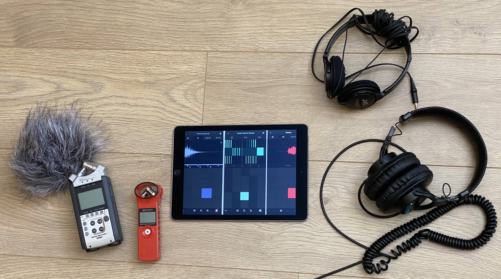
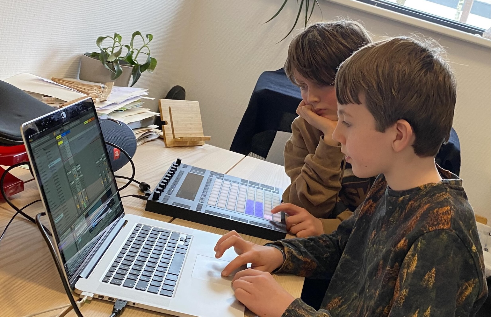
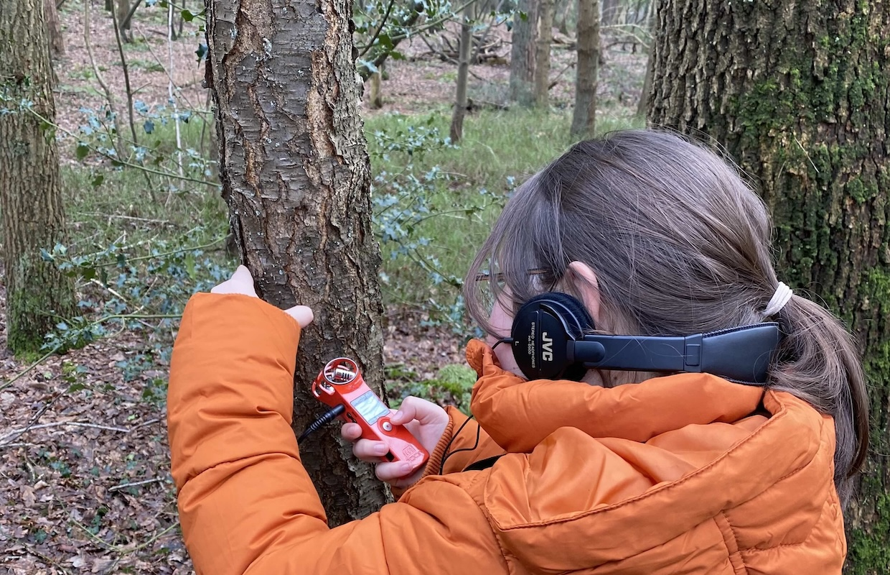
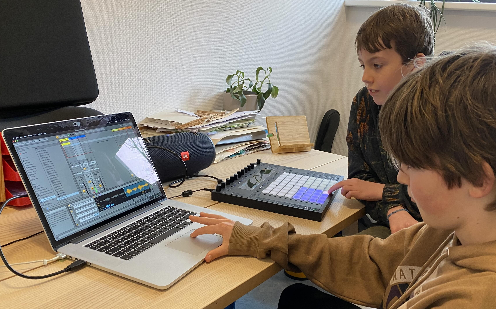

# Natuurbeats

Deze leskit is onderdeel van [GrondToon](./README.md), een cultuureducatief product, ontwikkeld door [Kayleigh Beard](https://kayleighbeard.nl/), in samenwerking met [Grond - school voor leven](https://grond-schoolvoorleven.nl/) en [Compenta](https://compenta.nl/). 

- *Doelgroep:* 9-15 jaar
- *Duur:* 4 lessen (±60 minuten per les)
- *Project:* GrondToon
- *Visie:* Verbinding met natuur, creativiteit en muzikaal ritmisch bewustzijn
- *Ontwikkeld door:* [Kayleigh Beard](https://kayleighbeard.nl/), in samenwerking met [Grond - school voor leven](https://grond-schoolvoorleven.nl/) en [Compenta](https://compenta.nl/). 

---

## 📌 Kern van Natuurbeats

De leskit Natuurbeats is een creatief en holistisch muziekproject voor leerlingen, gericht op het **verbinden met de natuur**, muziek en aandachtig luisteren. Gedurende vier lessen leren leerlingen niet alleen **muzikale ritmes** en het gebruik van een **DAW** (Digital Audio Workstation, zoals Ableton), maar ook om met volle **aandacht** de natuur in te gaan, **natuurgeluiden** op te nemen en deze om te zetten in **unieke beats**. Door stil te staan in de natuur, geluiden bewust op te nemen en deze vervolgens creatief te bewerken, ontdekken ze hoe muziek en omgeving met elkaar verweven zijn. Het project stimuleert niet alleen technisch en muzikaal ritmisch inzicht, maar ook een diepere **verbinding** met de wereld om hen heen, waarbij **creativiteit** en **samenwerking** centraal staan.

---

## 📌 Leerdoelen
1. Leerlingen kunnen met **aandacht** in de natuur zijn, **aandachtig luisteren** naar natuurgeluiden en deze ervaringen uitwisselen.
2. Leerlingen kunnen **muzikale ritmische concepten** toepassen (4/4 vs. 3/4 en diverse nootlengtes).
3. Leerlingen kunnen een **beat maken** met behulp van een DAW (Digital Audio Workstation).
4. Leerlingen kunnen **natuurgeluiden opnemen, samplen en bewerken** in een DAW.
5. Leerlingen kunnen **creatief experimenteren** met geluiden en deze omzetten in muziek.
6. Leerlingen kunnen **samenwerken** en hun werk presenteren aan anderen. 

---

## 📚 Materialen

#### Fysieke materialen

De volgende materialen zijn onderdeel van de GrondToon Klankbox:

| Materiaal               | Aantal               | Opmerking                          |
|-------------------------|----------------------|------------------------------------|
| Zoom recorder           | 1 per 2-3 leerlingen | Voor opnemen natuurgeluiden        |
| Headphones              | 1 per leerling       | Voor luisteren naar geluiden       |
| Laptop/Tablet             | 1 per leerling       | Voor DAW (GarageBand/BandLab)      |
| Drumstokken             | 2 per leerling       | Voor ritmische oefeningen          |
| Werkbladen (ritme)      | Per leerling         | Voor noteren van ritmes            |
| Notitieblok (natuur)    | Per leerling         | Voor opschrijven natuurgeluiden    |

#### Digitale bronnen

| Bron                    | Link                                  | Opmerking                          |
|-------------------------|---------------------------------------|------------------------------------|
| Ableton (Note) (iPad/Mac)   | [Apple App Store](https://apps.apple.com/nl/app/ableton-note/id1633243177) | Veelgebruikte DAW                         |
| GarageBand (iPad/Mac)   | [Apple App Store](https://apps.apple.com/nl/app/garageband/id682658836) | Gratis DAW                         |
| BandLab                 | [bandlab.com](https://www.bandlab.com/) | Gratis online DAW                  |
| Ritme-uitleg (YouTube)  | [Voorbeeldvideo](https://www.youtube.com/shorts/kALzvJpNpWw) | Voor ritme-concepten               |

 

---

## 🎧 Voorbeelden uit de praktijk

De volgende natuurbeats zijn gemaakt door leerlingen van [Grond - school voor leven](https://grond-schoolvoorleven.nl/):

<audio controls autoplay>
  <source src="./assets/audio/Natuurbeat-Axel-Pepe.mp3" type="audio/mpeg">
Your browser does not support the audio element.
</audio>

<audio controls autoplay>
  <source src="./assets/audio/Natuurbeat-Eline-Norah.mp3" type="audio/mpeg">
Your browser does not support the audio element.
</audio>

<audio controls autoplay>
  <source src="./assets/audio/Natuurbeat-Sanneke.mp3" type="audio/mpeg">
Your browser does not support the audio element.
</audio>

 

---

 

# 📅 Lesopbouw

 

## 🎵 Les 1: Ritmische Concepten
<iframe style="width: 100%; height:400px;" src="https://www.youtube.com/embed/kALzvJpNpWw" title="Musical notes and rhythms 🎻🎹" frameborder="0" allow="accelerometer; autoplay; clipboard-write; encrypted-media; gyroscope; picture-in-picture; web-share" referrerpolicy="strict-origin-when-cross-origin" allowfullscreen></iframe> 
**Doel:** Basisprincipes van ritme leren en toepassen.

| Onderdeel          | Activiteit                                                                 | Tijd   | Werkvorm       | Materialen               |
|--------------------|---------------------------------------------------------------------------|--------|----------------|--------------------------|
| **Introductie**    | Activerende vraag: *"Wat is ritme? Waar hoor je ritme in het dagelijks leven?"* | 5 min  | Klassikaal     | Whiteboard/schoolbord          |
| **Uitleg ritme**   | Uitleg over **4/4 vs. 3/4**, nootlengtes (hele, halve, kwart, achtste). Voorbeelden: "We Will Rock You" (4/4), "Waltz" (3/4). | 10 min | Klassikaal     | Whiteboard/schoolbord |
| **Ritmische oefeningen** | Leerlingen klappen, drummen (op djembes of tafel/drumstokken) en zingen ritmes na. Bijv.:   - 4/4: "ta-ta-ta-ta" (kwartnoten)   - 3/4: "ta-ta-ta" (drie tellen)   - Complex: "ta-ti-ti-ta" (achtste noten). | 15 min | Groepswerk     | Drumstokken, tafels      |
| **Ritme noteren**  | Leerlingen schrijven een eenvoudig ritme op papier (streepjes voor tellen). | 10 min | Individueel    | Werkblad, potlood        |
| **Afsluiting**     | Klassikaal ritme naspelen en bespreken: *"Welk ritme vond je het leukst?"* | 5 min  | Klassikaal     | -                        |

#### 🔹 Differentiatie:
- **Makkelijker:** Kant-en-klaar ritme om na te klappen.
- **Uitdagender:** Eigen ritme bedenken en noteren.

 

---

 

## 🎛️ Les 2: Beat Maken met een DAW

**Doel:** Kennismaken met een DAW en een eenvoudige beat maken.

| Onderdeel          | Activiteit                                                                 | Tijd   | Werkvorm       | Materialen               |
|--------------------|---------------------------------------------------------------------------|--------|----------------|--------------------------|
| **Introductie DAW**| Wat is een DAW? Voorbeelden: Ableton, GarageBand, BandLab. Luister naar een voorbeeldbeat. | 15 min | Klassikaal     | Laptop/Tablet, projector/smartboard   |
| **DAW verkennen**  | Leerlingen experimenteren met de DAW:   - Drumgeluiden selecteren.   - Eenvoudige beat maken (kick, snare, hi-hat).   - Ritme aanpassen (4/4, 3/4). | 20 min | Individueel    | Laptops/Tablets, DAW, koptelefoons        |
| **Beat delen**     | Leerlingen spelen hun beat af en bespreken: *"Wat vind je van je beat?"* | 15 min | Klassikaal     | -                        |
| **Afsluiting**     | Bespreken: *"Hoe voelt het om met een DAW te werken?"* | 10 min  | Klassikaal     | -                        |

#### 🔹 Tips voor de docent:
- Gebruik een DAW waar jij je prettig bij voelt. **Ableton (Note)** is veelgebruikt, maar je kunt ook gratis varianten gebruiken, zoals **GarageBand** (iPad/Mac) of **BandLab**.
- Geef een **stappenplan**:
  1. Kies een drumgeluid.
  2. Maak een ritme.
  3. Speel af.

#### 🔹 Differentiatie:
- **Makkelijker:** Kant-en-klare beat om te kopiëren.
- **Uitdagender:** Beat met twee verschillende ritmes (intro/refrein).

 

---

 

## 🌳 Les 3: Natuurgeluiden Opnemen in het Bos

**Doel:** Aandachtig luisteren en natuurgeluiden opnemen.

| Onderdeel          | Activiteit                                                                 | Tijd   | Werkvorm       | Materialen               |
|--------------------|---------------------------------------------------------------------------|--------|----------------|--------------------------|
| **Introductie**    | *"Vandaag gaan we luisteren naar de natuur. Wat hoor je als je stilstaat?"* | 5 min  | Klassikaal     | -                        |
| **Stiltewandeling**| Leerlingen lopen **5 minuten in stilte** en luisteren aandachtig. Daarna wisselen ze uit in groepjes. | 15 min | Groepswerk     | Notitieblok, pen         |
| **Opname-opdracht**| - Opdracht 1: Leerlingen nemen **natuurgeluiden** op (vogels, wind, bladeren). - Opdracht 2: Leerlingen nemen geluiden op door zelf geluid te maken met **natuurmaterialen** (takken, stenen, modder). Voorafgaand aan de opdracht klassikaal stilstaan bij hoe je dit doet met respect voor de natuur. | 25 min | Individueel    | Zoom recorder, headphones|
| **Terug in de klas**| Luisteren naar enkele opgenomen geluiden en bespreken: *"Welk geluid spreekt je aan?"* | 15 min | Klassikaal     | Laptop/Tablet              |

#### 🔹 Tips voor de docent:
- Kies een **rustige locatie** (bos/park) waar natuurgeluiden niet overstemd worden door andere geluiden, zoals verkeer.
- Zorg dat de leerlingen **met respect omgaan met de natuur**. Sta niet toe dat er dieren of planten verstoord of kapot gemaakt worden voor de opnames.
- Geef een **lijst met voorbeelden** (wind, vogels, stromend water).
- Laat leerlingen **eerst oefenen met de recorder**.

#### 🔹 Differentiatie:
- **Makkelijker:** Lijst met geluiden om op te nemen.
- **Uitdagender:** Verhaal vertellen met de geluiden.

 

---

 

## 🎚️ Les 4: Natuurgeluiden in de DAW

**Doel:** Beat maken met opgenomen natuurgeluiden.

| Onderdeel          | Activiteit                                                                 | Tijd   | Werkvorm       | Materialen               |
|--------------------|---------------------------------------------------------------------------|--------|----------------|--------------------------|
| **Introductie**    | *"Vandaag gebruiken we de opgenomen geluiden om een beat te maken."* | 5 min  | Klassikaal     | Laptop/Tablet, DAW         |
| **Geluiden selecteren** | Leerlingen kiezen **3-5 geluiden** om in hun beat te gebruiken. | 10 min | Individueel    | Laptops/Tablets met DAW, Koptelefoons             |
| **Beat maken**     | Leerlingen maken een beat in de DAW:   - Geluiden slepen.   - Ritme aanpassen (kick op tellen, snare op "en").   - Geluiden bewerken (volume, herhalen, effecten). | 25 min | Individueel    | DAW, koptelefoons        |
| **Beat presenteren** | Leerlingen spelen hun beat af en bespreken: *"Wat vind je van je beat?"* | 15 min | Klassikaal     | Laptop/Tablet, speakers    |
| **Afsluiting**     | Klassikaal gesprek: *"Wat was het leukst? Wat vond je moeilijk?"* | 5 min  | Klassikaal     | -                        |

#### 🔹 Tips voor de docent:
- Geef een **stappenplan**:
  1. Selecteer geluiden.
  2. Maak een ritme.
  3. Speel af.
- Moedig **experimenteren** aan (bijv. geluid sneller afspelen).

#### 🔹 Differentiatie:
- **Makkelijker:** Kant-en-klare beat met natuurgeluiden.
- **Uitdagender:** Tweede laag toevoegen (melodie of stem).

 

---

 

## 📊 Evaluatie

| Les  | Evaluatiemoment                          | Methode                          |
|------|------------------------------------------|----------------------------------|
| 1    | Ritme naspelen en noteren                | Observatie en feedback op ritmes en eventueel genoteerde ritmes   |
| 2    | Beat maken in DAW                        | Feedback op ritme en creativiteit|
| 3    | Natuurgeluiden noteren en bespreken      | Groepsdiscussie                  |
| 4    | Beat presenteren                         | Feedback op eindproduct en creativiteit          |

 

---

 

## 🔗 Link met andere GrondToon-Leskits

| Leskit                  | Link met Natuurbeats                     |
|-------------------------|------------------------------------------|
| Maak je eigen lied      | Beats uit Natuurbeats gebruiken als ritme|
| Stemexpressie           | Stemgeluid combineren met natuurgeluiden |
| Intuitief Improviseren  | Improviseren met natuurgeluiden in DAW   |

 

---

 

## 💡 Tips voor de Docent
#### Voorbereiding

- Zorg dat de **Laptops**, **Tablets**, en **recordingsapparatuur** vooraf zijn opgeladen.
- Zorg dat je van tevoren je hebt verdiept in de DAW naar keuze en hoe de recorders werken.
- Test de **DAW** vooraf.
- Kies een **rustige locatie** voor les 3 (bos/park) waar natuurgeluiden niet overstemd worden door andere geluiden, zoals verkeer.

#### Tijdens de les
- **Respect voor de natuur:** Zorg dat leerlingen respectvol omgaan met de natuur en geen dieren of planten onnodig verstoren bij het opnemen.
- **Tijdmanagement:** Houd rekening met overgangen tussen activiteiten.
- **Moedig experimenteren aan!** Laat leerlingen zelf ontdekken.
- **Geef positieve feedback** op creativiteit, niet alleen op techniek.
- **Houd de les interactief** door luisteren, bespreken en presenteren.

#### Na de les
- **Bewaar** de beats van leerlingen (USB-stick/cloud) met toestemming.
- **Deel** de beats met ouders of op school met toestemming.

 

---

 

**📌 Laatste update:** *20 mei 2026*
**📌 Versie:** 1.0
