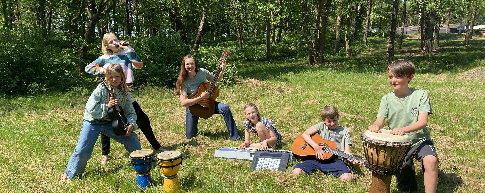
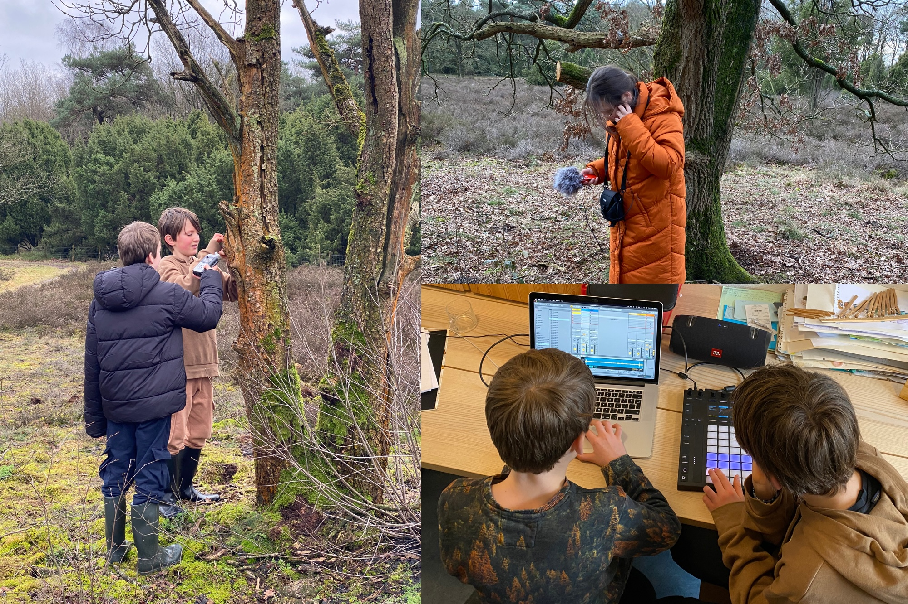
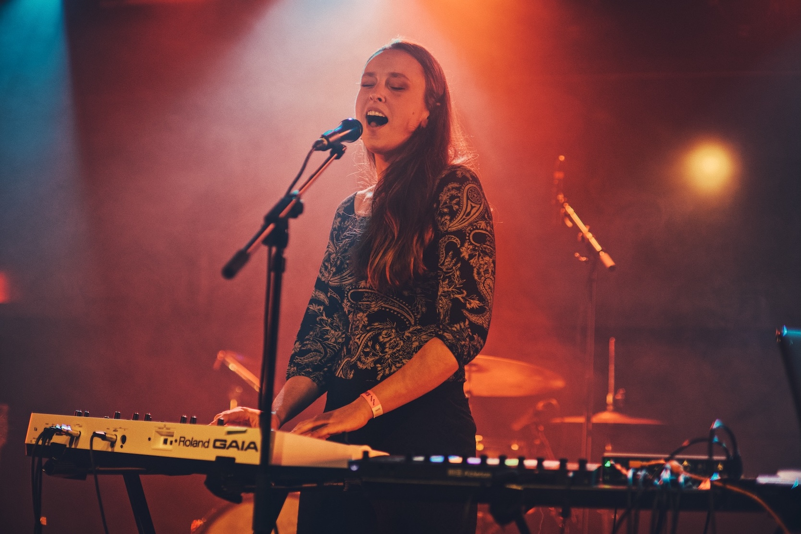

# GrondToon

GrondToon is een cultuureducatief product, ontwikkeld door [Kayleigh Beard](https://kayleighbeard.nl/), in samenwerking met [Grond - school voor leven](https://grond-schoolvoorleven.nl/) en [Compenta](https://compenta.nl/). 

#### Inleiding
GrondToon is een brede, **holistische benadering** van muziekleren, waarbij niet alleen technische vaardigheden (zoals noten lezen, instrument bespelen of zingen) centraal staan, maar ook emotionele, cognitieve, fysieke en zelfs spirituele aspecten van muziek worden meegenomen. Bij GrondToon werken leerlingen aan hun eigen **muzikale expressie**. In tegenstelling tot traditionele methodes, staat de **persoonlijke bron van creativiteit** van elke leerling centraal, en niet enkel de **muzikale vaardigheden**. Een ander uniek aspect is het integreren van **natuurgeluiden** en daarmee de **verbinding met de wereld** om ons heen. Het product dat is voortgevloeid uit dit ontwikkeltraject is de **GrondToon Klankbox**, een combinatie van digitale en fysieke materialen, die door diverse scholen kunnen worden gebruikt om dit project neer te zetten.

#### Eigen beleving en creativiteit
Wat GrondToon anders maakt, is de focus op **intrinsieke motivatie**, **persoonlijke creativiteit** en het uiten van de **innerlijke wereld**. Dit betekent dat muziek niet alleen als technisch vak wordt benaderd, maar als een middel om persoonlijke gevoelens en ideeën te uiten. Hierbij staan hun eigen beleving en **innerlijk lied** centraal, wat bijdraagt aan een diepgaande persoonlijke ontwikkeling die verder reikt dan enkel muzikale vaardigheden. 

Door middel van het **schrijven van eigen liedjes** ontdekken en ontwikkelen leerlingen hun muzikale en persoonlijke potentieel. We onderzoeken hoe gevoelens, gedachten en ideeën muzikaal kunnen worden vertaald. We spelen, zingen en luisteren ook naar bestaande muziek, waarbij we samen de betekenis ervan ontdekken, zowel op persoonlijk vlak als vanuit een taalkundig perspectief. Naast de Nederlandse taal zijn ook andere talen hier onderdeel van, waardoor er binnen muzikale ontwikkeling ook **vakoverstijgend** gewerkt wordt. 

#### Natuurgeluiden
Een ander uniek aspect van GrondToon is het integreren van natuurgeluiden in muziekcreaties. Hierdoor leren ze niet alleen muzikale vaardigheden, maar ook om bewust te worden van hun omgeving en de **verbinding met de natuur**. Dit proces stimuleert een diepere verbinding met de wereld om hen heen en inspireert **creativiteit op een organische manier**.

De visie van de school benadrukt de intrinsieke waarde van muziek maken, waarbij verbinding centraal staat: verbinding met zichzelf, met anderen en met de natuurlijke omgeving. Het opnemen en verwerken van natuurgeluiden versterkt deze verbinding en creëert een leeromgeving waarin leerlingen hun creativiteit volledig kunnen ontplooien en waar gemeenschapsgevoel wordt versterkt.

#### De GrondToon Klankbox
Het ontdekken, voelen en laten horen van de innerlijke grondtoon is de kern van wat ik met GrondToon wil uitdragen. Dit project heeft geresulteerd in de **GrondToon Klankbox**, een combinatie van digitale en fysieke materialen, instructies, en inspirerende voorbeelden van het GrondToon project. 

De **GrondToon Klankbox** bestaat uit de volgende onderdelen:

- Leskit <a href="#natuurbeats">Natuurbeats</a>
- Leskit <a href="#stemexpressie">Innerlijk Lied</a>
- Leskit <a href="#stemexpressie">Stemexpressie</a>
- Leskit <a href="#stemexpressie">Intuitief Improviseren</a>
- Extra: <a href="#stemexpressie">Bewegen op Muziek</a>

---

## Natuurbeats

De leskit Natuurbeats is een creatief en holistisch muziekproject voor leerlingen van 8-14 jaar, gericht op het **verbinden met de natuur**, muziek en aandachtig luisteren. Gedurende vier lessen leren leerlingen niet alleen **muzikale ritmes** en het gebruik van een **DAW** (Digital Audio Workstation, zoals Ableton), maar ook om met volle **aandacht** de natuur in te gaan, **natuurgeluiden** op te nemen en deze om te zetten in **unieke beats**. Door stil te staan in de natuur, geluiden bewust op te nemen en deze vervolgens creatief te bewerken, ontdekken ze hoe muziek en omgeving met elkaar verweven zijn. Het project stimuleert niet alleen technisch en muzikaal ritmisch inzicht, maar ook een diepere **verbinding** met de wereld om hen heen, waarbij **creativiteit** en **samenwerking** centraal staan.

Zie hier de volledige leskit: [Leskit Natuurbeats](./PAGE-Natuurbeats.html).

---

## Innerlijk Lied

---

## Stemexpressie

---

## Intuitief Improviseren

---

## GrondToon Klankbox

---

## Bewegen op muziek

---

## Over mij

Hoi, ik ben Kayleigh Beard, woonachtig in Groningen. Naast mijn activiteiten in het onderwijs, ben ik multidisciplinair muzikant en solo artiest. Ik maak elektronische artpop en sta regelmatig op het podium. Luister eens naar mijn nieuwste album [Mutations](https://kayleigh-beard.ffm.to/mutations1){:target="_blank"} (2026).

Of bekijk mijn [Website](https://kayleighbeard.nl/){:target="_blank"}, [Instagram](https://www.instagram.com/kayleigh.beard.music/){:target="_blank"}, of [Youtube](https://www.youtube.com/@KayleighBeard5){:target="_blank"}.

Interesse in GrondToon op jouw school/organisatie? Neem contact op via mijn [contactpagina](https://kayleighbeard.nl/#contact). 